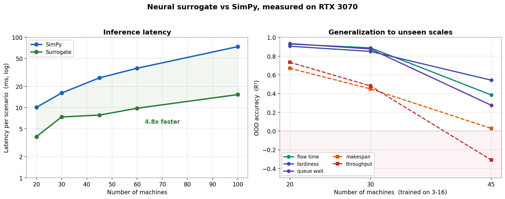

# Neural Simulator

A graph neural network surrogate for discrete-event supply-chain simulation.

A SimPy simulator models a small manufacturing scenario (machines, orders,
routes, finite buffers) and computes KPIs such as makespan, throughput, flow
time, and tardiness. This project trains a GNN to predict those KPIs directly
from the scenario graph, without running the simulation. The simulator stays the
source of truth; the surrogate is a fast approximation for "what-if" search over
a fixed plant.

```
supply-chain scenario  --GNN-->  KPIs + bottleneck estimate
```

The project is managed with [`uv`](https://docs.astral.sh/uv/).

## Install

```powershell
uv sync --group dev          # simulator, data pipeline, CLI, tests
uv sync --group dev --group ml   # add torch + torch_geometric for the GNN models
```

## Quickstart

Simulate one generated scenario:

```powershell
uv run neural-simulator simulate --seed 7 --machines 4 --orders 8
```

Run the fast heuristic surrogate demo on the checked-in example:

```powershell
uv run neural-simulator demo --scenario examples/scenario.json
```

Generate a small dataset and evaluate the classical baselines:

```powershell
uv run neural-simulator generate-dataset --count 100 --seed 3 --output-dir data/poc
uv run neural-simulator evaluate-heuristic --dataset data/poc/test.jsonl
uv run neural-simulator evaluate-baselines --train data/poc/train.jsonl --test data/poc/test.jsonl
```

## Topology holdout

The generalization benchmark trains on small layouts and tests on larger,
structurally unseen ones (longer, shuffled, and re-entrant routes):

```powershell
uv run neural-simulator generate-topology-holdout --train-count 1000 --validation-count 150 --test-count 150 --seed 11 --output-dir data/topology-holdout
uv run neural-simulator evaluate-baselines --train data/topology-holdout/train.jsonl --test data/topology-holdout/test.jsonl
```

## Train the Graph Transformer

```powershell
uv run neural-simulator train-graph-transformer --train data/poc/train.jsonl --validation data/poc/validation.jsonl --device auto --node-encoder schema_attention --early-stopping-patience 10
uv run neural-simulator evaluate-graph-transformer --checkpoint checkpoints/graph_transformer.pt --dataset data/poc/test.jsonl --device auto
```

- `--device cuda` requires a GPU; `--device auto` prefers CUDA and falls back to CPU.
- `--early-stopping-patience 0` disables early stopping; otherwise the saved
  checkpoint is the best validation epoch, not the final one.
- `--node-encoder linear` selects the older flat-vector encoder instead of the
  default schema-aware attention encoder.

## Reproduce the frontier results

The frontier charts come from one pipeline: generate datasets, train three
configurations, run a latency sweep, render the charts. Run the whole thing
with:

```powershell
uv sync --group dev --group ml
uv run python scripts/reproduce_frontier.py
```

The `ml` group includes matplotlib, so the charts render in the same
environment. Pass `--skip-data`, `--skip-train`, `--skip-speed`, or
`--skip-charts` to run only part of the pipeline, or `--chart-python` to render
charts with a different interpreter. The individual scripts can also be run
directly:

| Script | Output |
|--------|--------|
| `scripts/gen_frontier_data.py` | `data/frontier/*.jsonl` |
| `scripts/frontier_experiment.py` | `results/frontier_*.json` |
| `scripts/machines_sweep.py` | `results/machines_1000orders.json` |
| `scripts/results_chart.py` | `assets/frontier_results_chart.png` |
| `scripts/machines_sweep_chart.py` | `assets/latency_1000orders.png` |

## Models

| Model | File | Notes |
|-------|------|-------|
| TransformerConv | `src/neural_simulator/models/graph_transformer.py` | Local attention, O(\|E\|), fastest. |
| GraphGPS | `src/neural_simulator/models/graph_gps.py` | Local MPNN plus global attention (`multihead` or `performer`). Best accuracy. |
| Multi-scale pooling | `src/neural_simulator/models/multiscale_pool.py` | GATv2 plus Set2Set, type-aware readout. |

The Performer (linear attention) GraphGPS without RWSE is the recommended
configuration.



## Simulator scope

The simulator is intentionally small but models effects beyond fixed-route
processing:

- `setup_time_by_product_transition`: a machine pays setup time when it switches
  product type. Setup time counts as machine busy time.
- `dispatch_rule`: queued jobs are selected by `fifo`, `earliest_due_date`, or
  `shortest_processing_time`. Rules choose only between jobs already waiting; an
  idle machine starts the first arriving job immediately.
- `input_buffer_capacity`: a finite input queue per machine. When the next
  machine's buffer is full, the upstream machine stays occupied and records
  blocked time.

## Repository layout

```
src/neural_simulator/
  simulation/   SimPy discrete-event simulator and scenario generator
  data/         dataset generation and loading
  graphs/       scenario -> graph dict -> PyG Data, plus cached templates
  models/       baselines and GNN architectures
  evaluation/   metrics, baseline scorecard, heuristic surrogate
  training/     training loops
scripts/        experiment and chart scripts
assets/         figures and charts
```

